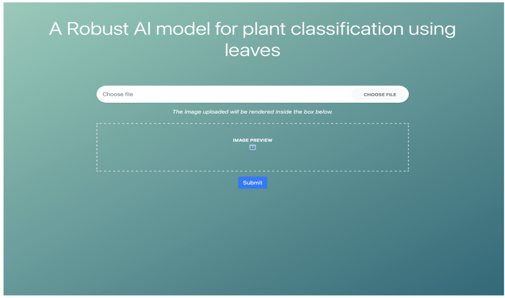
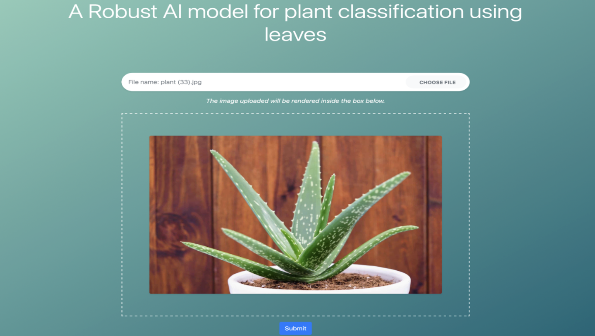
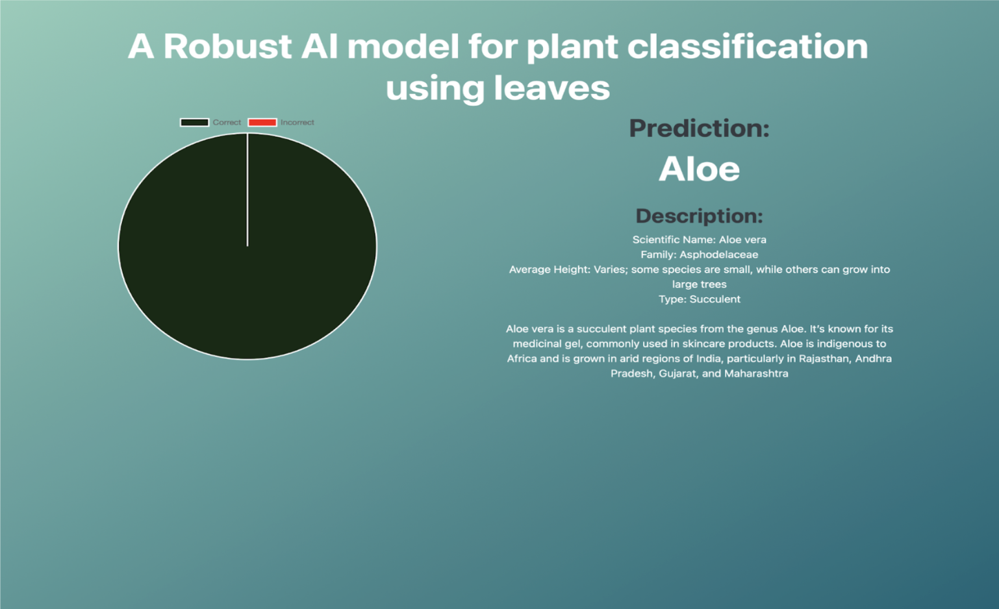
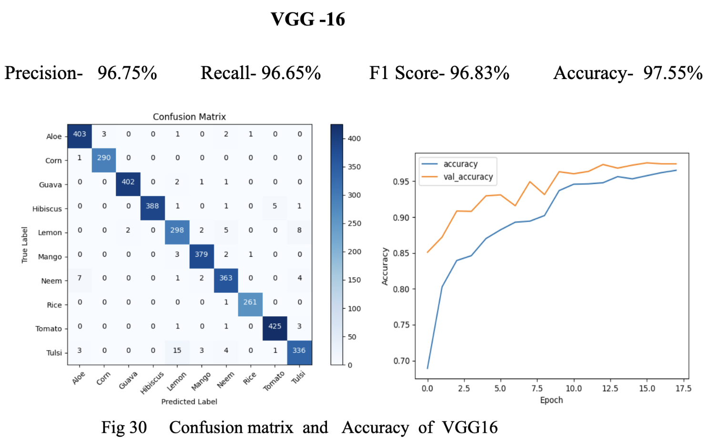
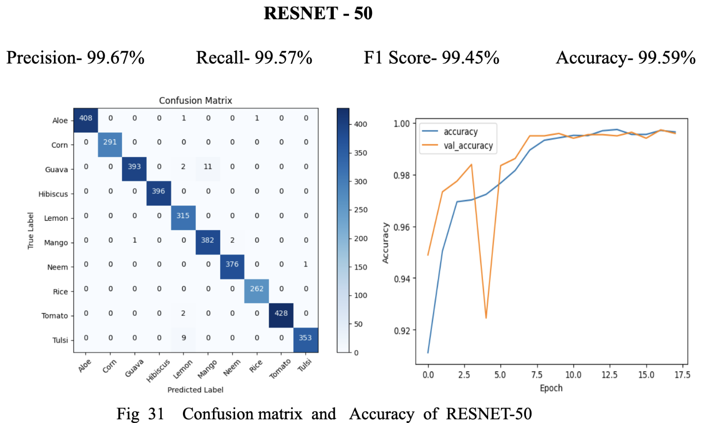
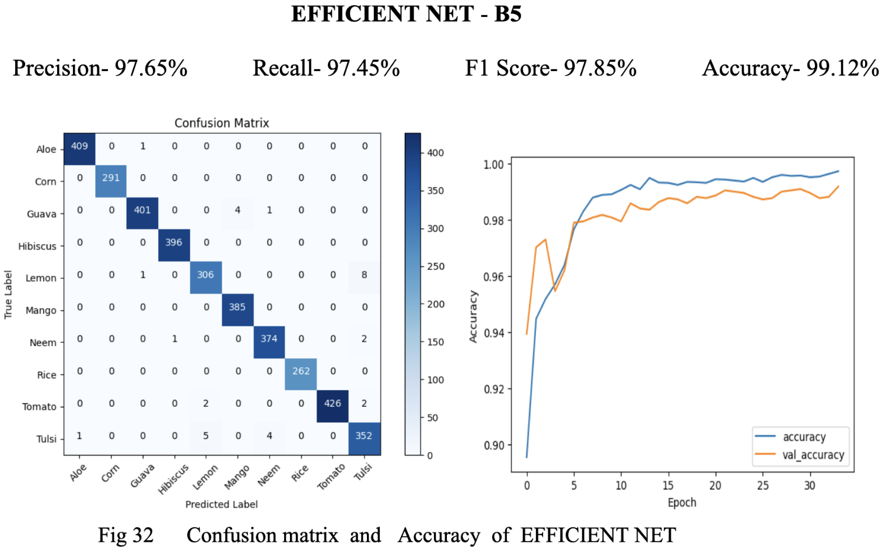
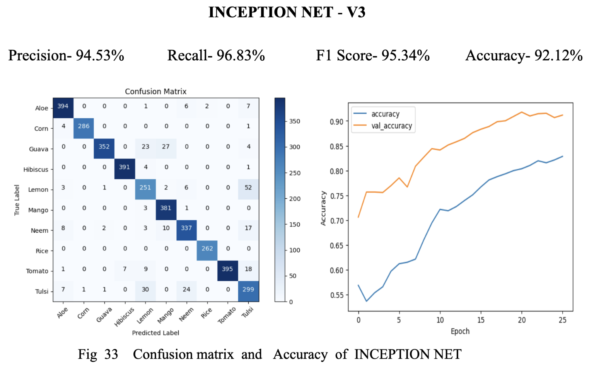
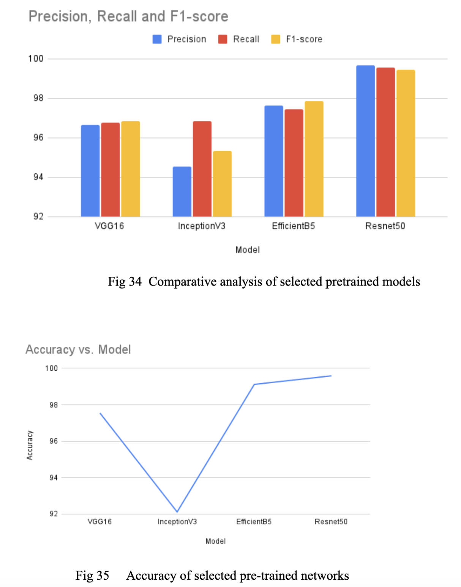

# Plant Classification Using Leaves

This project implements a deep learning-based plant classification system that identifies plant species based on images of their leaves. The model uses powerful neural networks such as VGG, ResNet, EfficientNet, and Inception to achieve accurate classification.

## Model

You can access the model [here](https://drive.google.com/file/d/1HxlYJbJfZbKNdgn794rU6xR-nOIfER9h/view?usp=sharing). The model is pre-trained and designed to classify plant species effectively using the leaf images provided by users.

---

## Web Page

### Home Page

The homepage of the application provides a user-friendly interface where users can easily upload leaf images and get the classification result.

### Upload Images and Result

Users can upload their leaf images here, and the system will process them to provide the classification result.

---

## Results

The model uses different architectures to classify the leaf images. Here are the results for various deep learning models:

### VGG Model

VGG is a simple yet effective model that is utilized for the classification of plant leaves.

### ResNet Model

ResNet, with its residual connections, improves the accuracy and performance, especially for deeper models.

### EfficientNet Model

EfficientNet is a highly efficient model that balances accuracy and resource usage, making it ideal for real-world applications.

### Inception Model

Inception model uses multiple convolution filters to capture diverse features from the images, offering robust performance.

---

## Comparison

### Model Performance Comparison

This comparison chart shows the performance of different models (VGG, ResNet, EfficientNet, and Inception) based on the classification accuracy of the plant leaf images. It helps in understanding which model provides the best results for this particular task.

---

This repository demonstrates how deep learning models can be applied for plant classification using leaf images, offering users a powerful tool for quick plant species identification.